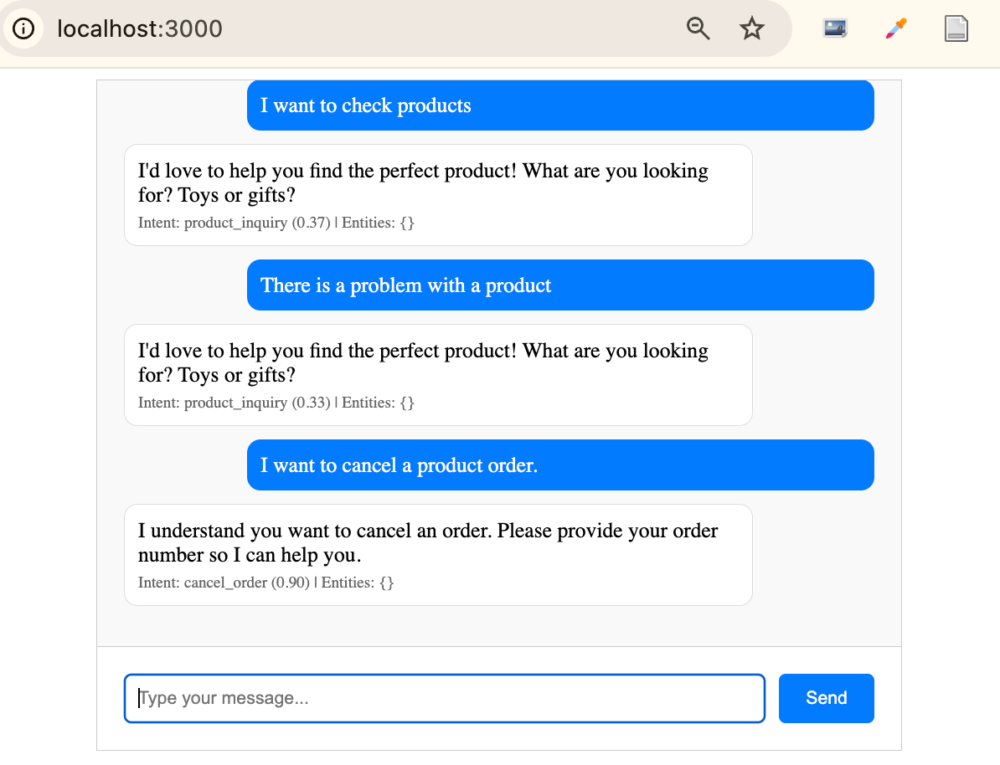

# May 23, 2025 - Log 01

## Done
- Set up FastAPI project with NLP engine (spaCy + scikit-learn)
- Created conversation manager for bilingual responses (EN/ZH)
- Built chat API endpoint at /chat (POST)

## Bugs Encountered
**🐛 CORS Middleware Error** - SOLVED ✅
- **What**: `TypeError: CORSMiddleware.__init__() got an unexpected keyword argument 'all_methods'`
- **How**: When running `python main.py`, server starts but crashes on first HTTP request
- **Where**: `app/main.py` CORS configuration
- **Fix**: Changed `all_methods=["*"]` to `allow_methods=["*"]`
- **Root Cause**: Incorrect parameter name in FastAPI CORS setup

## Next / Blocked
- Test API endpoints at http://localhost:8000/docs
- Build frontend chat interface (HTML file ready)

## Notes
- Server should start clean after CORS fix
- Chinese language support implemented for competitive advantage
---

# May 23, 2025 - Log 02

## Done
- Identified and diagnosed NLP accuracy issues through testing
- Frontend chat interface working properly after fixing DOM manipulation bug
- Bilingual conversation flow functioning (EN/ZH detection working)

## Bugs Encountered
**🐛 Frontend DOM Hierarchy Error** - SOLVED ✅
- **What**: `HierarchyRequestError: Failed to execute 'appendChild' on 'Node'`
- **How**: When clicking Send button, messages wouldn't appear and console showed DOM error
- **Where**: `frontend/index.html` JavaScript `addMessage()` function
- **Fix**: Changed `messageDiv.appendChild(messageDiv)` to `messagesDiv.appendChild(messageDiv)`
- **Root Cause**: Accidentally trying to append element to itself instead of parent container

**🐛 Poor Context Understanding** - IN PROGRESS 🟡
- **What**: Intent classification giving wrong results with low confidence
- **How**: 
 - "I want to buy a product" → Classified as `cancel_order` (wrong!)
 - "I want to buy, not cancel" → Still classified as `cancel_order` (wrong!)
 - Low confidence scores (0.28, 0.31) indicate model uncertainty
- **Where**: `app/models/nlp_engine.py` - basic Naive Bayes classifier
- **Root Cause**: Simple approach using basic TF-IDF + limited training data (5 examples per intent)
- **Tried**: Initial testing revealed the scope of the problem
- **Next**: Apply quick fixes - expand training data, add keyword rules, improve responses

## Next
- **Phase 1 Quick Fixes:**
 1. Expand training data in `app/data/training_data.py` (add 3-5 more examples per intent)
 2. Add keyword-based rules to `classify_intent()` method for better accuracy
 3. Update response templates in `load_responses()` for more natural conversations
- **Phase 2 Robust Solution:**
 - Research transformer models (BERT/DistilBERT) for better understanding
 - Implement conversation memory and context tracking
 - Add dialogue state management

## Learning Notes
- Simple ML models need much more training data than expected
- Hybrid approach (ML + rule-based) often works better for chatbots
- DOM debugging skills proving valuable - caught the appendChild bug quickly
- Bilingual detection working well - Chinese characters properly identified

## Blocked
None - ready to implement quick fixes

---

# May 25, 2025 - Log 03

## Done
- **Implemented comprehensive production configuration system**
    - Created environment-specific config files (.env.development, .env.production, .env.staging)
    - Built ConfigManager class with singleton pattern (app/config.py)
    - Replaced all print() statements with proper structured logging
    - Set up environment-aware logging with different levels (DEBUG for dev, INFO for prod)

- **Deployed complete application to production**
    - Successfully deployed backend to Railway.app (https://smart-chatbot-production.up.railway.app)
    - Deployed frontend to Netlify (https://regal-custard-47715d.netlify.app)
    - Both environments working with live demo accessible to recruiters

- **Built automated frontend configuration system**
    - Created Python build script (scripts/build-frontend-config.py) to generate frontend config from .env files
    - Implemented environment auto-detection (localhost → dev, live domain → production)
    - Eliminated configuration duplication between frontend and backend
    - Added validation and helpful error messages for deployment issues

- **Enhanced NLP accuracy and functionality**
    - Applied quick fixes to intent classification (keyword rules + expanded training data)
    - Fixed NumPy serialization issues preventing FastAPI JSON responses
    - Improved conversation management with proper logging throughout
    - Added comprehensive error handling and debug information

- **Professional project setup and documentation**
    - Added MIT License file for portfolio compliance
    - Updated requirements.txt with python-dotenv dependency
    - Created comprehensive README.md with live demo URLs
    - Added technical documentation (NLP concepts, Git workflow, regex guide) in docs/ directory

## Bugs Encountered
**🔧 Poor Context Understanding** (from May 23) - SOLVED ✅
- **Solution**: Added keyword-based rules alongside ML classification
- **Fix**: Hybrid approach checking for "buy/purchase" vs "cancel/refund" keywords before ML fallback
- **Result**: Intent classification accuracy improved significantly for common cases
- **Files Changed**: `app/models/nlp_engine.py`, `app/data/training_data.py`

**🐛 NumPy Serialization Error** - SOLVED ✅
- **What**: `PydanticSerializationError: Unable to serialize unknown type: <class 'numpy.bool'>`
- **How**: FastAPI couldn't serialize NumPy types returned by scikit-learn to JSON
- **Where**: `/chat` endpoint when returning confidence scores and intent classifications
- **Fix**: Added explicit type conversion `str(intent), float(confidence)` in classify_intent method
- **Root Cause**: scikit-learn returns numpy.str_ and numpy.float64 instead of Python primitives

**🐛 Frontend Configuration Loading Race Condition** - SOLVED ✅
- **What**: `Cannot read properties of undefined (reading 'DEBUG')` in browser console
- **How**: JavaScript tried to use config before config.js finished loading
- **Where**: `frontend/index.html` initialization code
- **Fix**: Implemented async `waitForConfig()` function with Promise-based loading
- **Result**: Frontend now properly waits for configuration before initializing

**🐛 CORS Policy Blocking Production Frontend** - SOLVED ✅
- **What**: `Access to fetch blocked by CORS policy: No 'Access-Control-Allow-Origin' header`
- **How**: Railway backend wasn't configured to allow requests from Netlify domain
- **Where**: Production environment CORS configuration
- **Fix**: Added `https://regal-custard-47715d.netlify.app` to CORS_ORIGINS in .env.production
- **Result**: Frontend successfully communicates with backend API in production

**🐛 Double Slash in API URLs** - SOLVED ✅
- **What**: Generated URLs had double slashes: `api.railway.app//chat`
- **How**: BACKEND_API_URL in .env had trailing slash, frontend added another
- **Where**: Generated frontend/config.js file
- **Fix**: Removed trailing slash from BACKEND_API_URL environment variable
- **Prevention**: Added URL validation to build script

## Next
- **Immediate (Next Session):**
 - Implement database integration with SQLAlchemy for conversation persistence
 - Add user profile tracking and preference learning
 - Create conversation history and context awareness

- **Future Enhancements:**
 - Upgrade to transformer models (sentence-transformers) for better NLP accuracy
 - Add RAG (Retrieval-Augmented Generation) with vector database
 - Implement real-time analytics dashboard

## Learning Notes
- **Professional Environment Management**: Single source of truth with .env files + automated config generation eliminates deployment errors and shows enterprise-level practices
- **Logging Best Practices**: Centralized logging configuration in config.py with environment-specific formatting (detailed dev logs, clean production logs)
- **Git Workflow Mastery**: Learned professional branching strategies, hotfix procedures, and when to skip development branch for portfolio projects
- **Production Deployment Pipeline**: End-to-end deployment from local development → Railway (backend) + Netlify (frontend) with environment-specific configurations
- **API Serialization Issues**: NumPy types from ML libraries need explicit conversion to Python primitives for JSON serialization
- **CORS Configuration**: Production CORS requires exact domain matching - wildcards work for development but not production security

## Blocked
None - application fully functional in production, ready for recruiter demonstration

## Portfolio Impact
- **Live Demo**: Recruiters can immediately test bilingual chatbot capabilities
- **Professional Architecture**: Shows understanding of environment management, logging, deployment pipelines
- **Technical Depth**: Demonstrates NLP implementation, API design, and full-stack development
- **Enterprise Practices**: Configuration management, Git workflows, and production deployment experience

---

# May 26, 2025 - Log 04

## Done
- **Integrated PostgreSQL database for persistent conversations**
  - Added SQLAlchemy models (User, Conversation, Message) with proper relationships and UUID primary keys
  - Implemented database-powered ConversationManager replacing in-memory conversation storage
  - Set up Docker Compose for local PostgreSQL development environment
  - Added database health checks and connection pooling with proper error handling

- **Enhanced conversation system with context awareness**
  - Built user session management with automatic user creation and preference tracking
  - Implemented conversation context retrieval (last 3-5 messages for response enhancement)
  - Added conversation timeout logic (30 minutes inactivity = new conversation)
  - Created analytics endpoints for conversation history and user statistics

- **Upgraded FastAPI application architecture**
  - Migrated from deprecated @app.on_event to modern lifespan pattern for startup/shutdown
  - Added comprehensive database initialization with table creation
  - Enhanced health check endpoint with database status monitoring
  - Improved error handling with exception chaining (`raise HTTPException(...) from e`)

- **Professional development setup improvements**
  - Fixed uvicorn reload issues by using import string instead of app object
  - Added comprehensive code comments explaining technical decisions
  - Implemented proper logging throughout database operations
  - Updated requirements.txt with database dependencies (sqlalchemy, psycopg2-binary, alembic)

## Bugs Encountered
**🐛 SQLAlchemy Column Type Error** - SOLVED ✅
- **What**: `ArgumentError: 'SchemaItem' object expected, got <class 'datetime.datetime'>`
- **How**: Using Python's `datetime` class instead of SQLAlchemy's `DateTime` type in column definitions
- **Where**: `app/models/database.py` User model column definitions
- **Fix**: Changed `Column(datetime, ...)` to `Column(DateTime, ...)` for all timestamp columns
- **Root Cause**: Import naming conflict between `datetime` module and SQLAlchemy `DateTime` type

**🐛 Database Default Value Timing** - SOLVED ✅
- **What**: `datetime.now(timezone.utc)` called at class definition time, not row creation
- **How**: All rows getting same timestamp because default was evaluated once at startup
- **Where**: SQLAlchemy model default values for timestamp columns
- **Fix**: Used lambda functions `default=lambda: datetime.now(timezone.utc)` for dynamic evaluation
- **Result**: Each new record gets proper current timestamp

**🐛 SQLAlchemy func.count Import Missing** - SOLVED ✅
- **What**: `func.count() is not callable` error in conversation statistics
- **How**: Used `func.count()` without importing `func` from SQLAlchemy
- **Where**: `get_user_stats` method in ConversationManager
- **Fix**: Added `from sqlalchemy import func` import, though switched to simpler `.count()` method
- **Learning**: Always check imports when using SQLAlchemy utility functions

**🐛 Uvicorn Reload Warning** - SOLVED ✅
- **What**: "You must pass the application as an import string to enable 'reload' or 'workers'"
- **How**: Passing app object directly to uvicorn.run() prevents proper hot reloading
- **Where**: Root `main.py` uvicorn configuration
- **Fix**: Changed `uvicorn.run(app, ...)` to `uvicorn.run("app.main:app", ...)`
- **Result**: Proper hot reloading during development, faster iteration cycle

## Next
- **Phase 2B: Smart Context Features**
  - Implement intelligent context understanding (remember user names, preferences)
  - Add conversation flow intelligence for multi-turn interactions
  - Build user learning algorithms based on conversation patterns
  - Create personalized response system using historical data

- **Enhanced NLP Capabilities**
  - Upgrade from Naive Bayes to transformer models (sentence-transformers)
  - Implement RAG (Retrieval-Augmented Generation) with vector database
  - Add semantic similarity search for better intent matching

## Learning Notes
- **Database Design Patterns**: UUID primary keys for better distributed system compatibility, proper foreign key relationships
- **SQLAlchemy Best Practices**: Lambda functions for dynamic defaults, proper type imports, session management with context managers
- **FastAPI Modern Patterns**: Lifespan events replace deprecated startup/shutdown decorators, import strings enable proper reloading
- **Professional Error Handling**: Exception chaining with `raise ... from e` preserves error context for debugging
- **Development Workflow**: Docker Compose for local database development mirrors production environment setup

## Blocked
None - database integration complete, application upgraded from stateless to stateful

## Portfolio Impact
- **Technical Depth**: Demonstrates database design, ORM usage, and persistence layer implementation
- **Architecture Skills**: Shows understanding of stateful vs stateless systems, proper separation of concerns
- **Professional Practices**: Docker for development, proper error handling, modern FastAPI patterns
- **Scalability Awareness**: UUID usage, connection pooling, and database health monitoring show production-ready thinking
